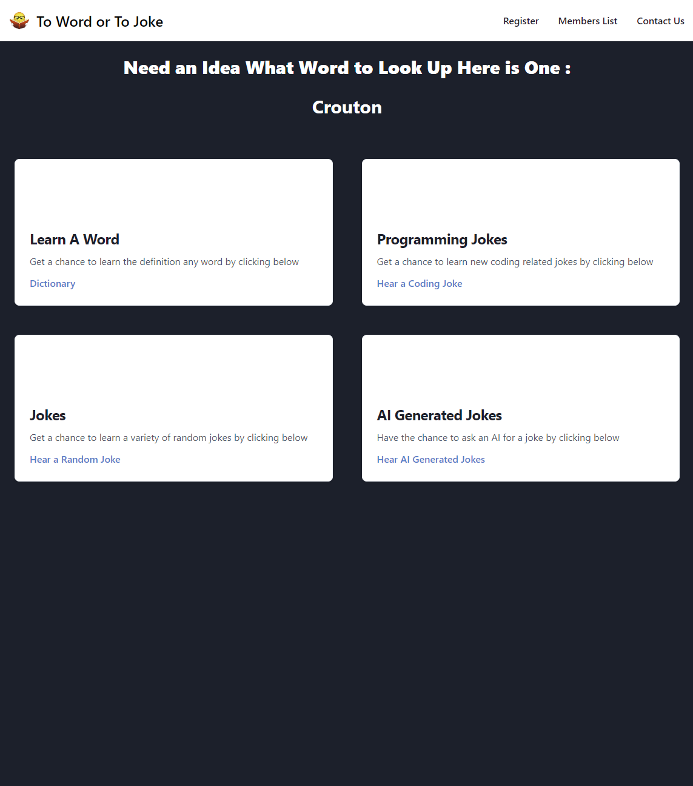
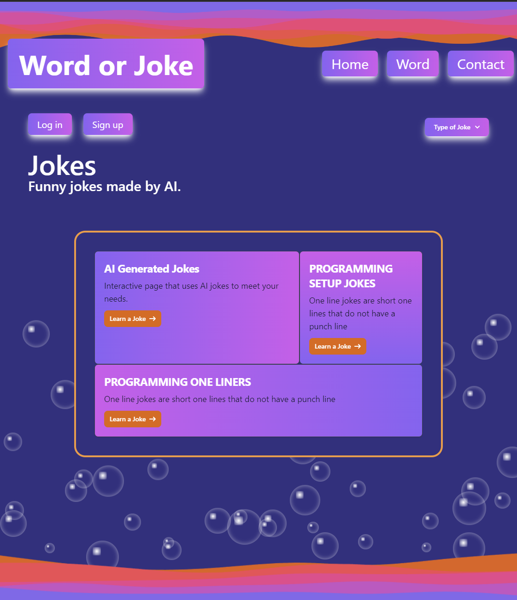

#Elevator Pitch 
To joke or to word. Our research website solves the problem of having to guess the definition while also having a little bit of fun by being able to read a joke. Our motivation is to create a fun interactive website and also to practice our newly learned coding skills in a group setting. We plan on using a Merriam Webster dictionary api (https://dictionaryapi.com/products/api-collegiate-dictionary) and a joke api (https://sv443.net/jokeapi/v2/) to help us create our website. We will be also using tailwind css to style our website to make it more appealing. Users should prioritize using our website for simplicity of use and to make their research more interesting and fun. Don't worry about forgetting your previous newly learned jokes or words because we will include the last five newly learned jokes and words by adding local storage.  

## Description

Our project presents the user with two options to pass their free time. There are met with a home page that allows them to select which option they would like to explore. The home page gives them an option to sign into the website and view other members who are part of the sight. The first option is to use the dictionary website to look up new words. We also make a random suggestion of a new word to learn to help get them started. The second option is a page that presents several different catagories of jokes for them to read. Each joke is randomly generated and one of the catagories allows them to input a word they would like to be incorporated into the joke. We also use a random word generator to create jokes out of random words. 

- The motivation for creating the project is to create a fun and interactive website and also to practice our newly learned coding skills in a group setting
- We built the project to practice working in a group setting and to create a fun web page to demonstrate our ability to code a interactive website and work in a team. 
- This web site solves the problem of being able to look up words and get there definition and also to find fun jokes to share with your friends. 
- We learned how to use local storage, API, and the Tailwind CSS framework. 

GitHub link: https://github.com/chigreene/To-Word-or-To-Joke

URL: http://127.0.0.1:5500/Whimsical-Education/index.html

## Credits
Venoude Valmyr
Chris Greene
Piero Rodriguez